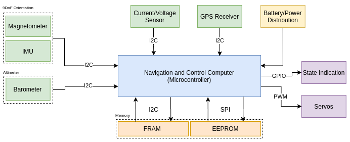

# Flight Computer

### Microcontroller

[_STM32F415_](https://www.st.com/content/st_com/en/products/microcontrollers-microprocessors/stm32-32-bit-arm-cortex-mcus/stm32-high-performance-mcus/stm32f4-series/stm32f405-415/stm32f415rg.html)_\(_[_Datasheet_](https://www.st.com/resource/en/datasheet/stm32f405vg.pdf)_\) ARM M4 CPU with 1MB Flash and 168MHz clock speed and **available on JLCPCB**_

### 9DoF Orientation Sensor \(IMU + Magnetometer\)

\_\_[_BMX055_ ](https://www.bosch-sensortec.com/products/motion-sensors/absolute-orientation-sensors/absolute-orientation-sensors-bmx055.html)_\(_[_Datasheet_](https://www.bosch-sensortec.com/media/boschsensortec/downloads/datasheets/bst-bmx055-ds000.pdf)\)_with gyroscope, accelerometer, and magnetometer, used for drone applications **and available on JLCPCB**_

* Supports I2C & SPI \(3/4 wire\)
* Input voltage: 2.4V to 3.6V
* Independent polling for each of the sensors

### Barometer

\_\_[_BMP38_](https://www.bosch-sensortec.com/products/environmental-sensors/pressure-sensors/bmp388/)_8\(_[_Datasheet_](https://www.bosch-sensortec.com/media/boschsensortec/downloads/datasheets/bst-bmp388-ds001.pdf)_\) 300-1250 hPa **and NOT available on JLCPCB**_

* Supports I2C & SPI \(3/4 wire\)
* Input voltage: 1.65V to 3.6V
* Sampling frequency 200Hz

### Current/Voltage/Power Monitor

[INA219](https://www.ti.com/product/INA219?HQS=TI-null-null-digikeymode-df-pf-null-wwe&DCM=yes&distId=10)\([Datasheet](https://www.ti.com/lit/ds/symlink/ina219.pdf?ts=1596310228469&ref_url=https%253A%252F%252Fwww.ti.com%252Fproduct%252FINA219%253FHQS%253DTI-null-null-digikeymode-df-pf-null-wwe%2526DCM%253Dyes%2526distId%253D10)\) I2C compatible, max voltage 26, _**and available on JLCPCB**_

###  __ 

